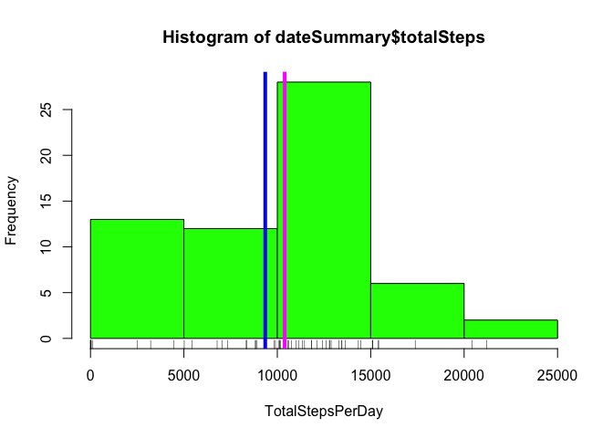
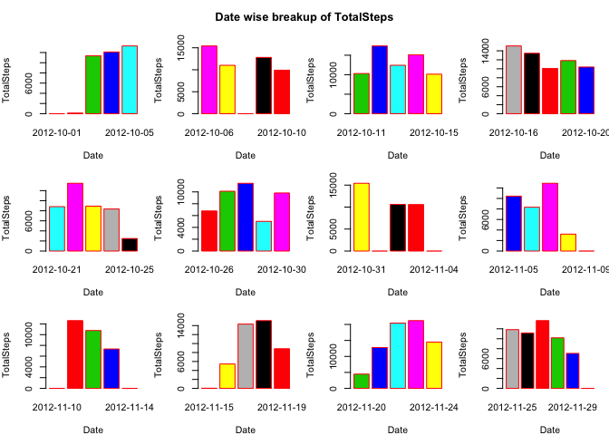
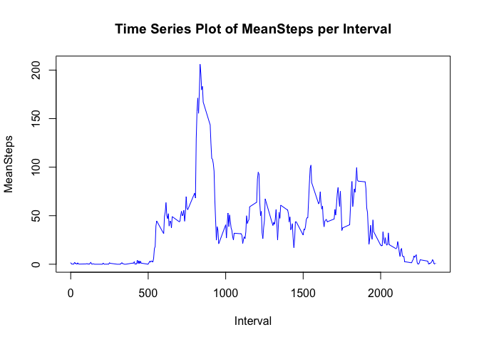
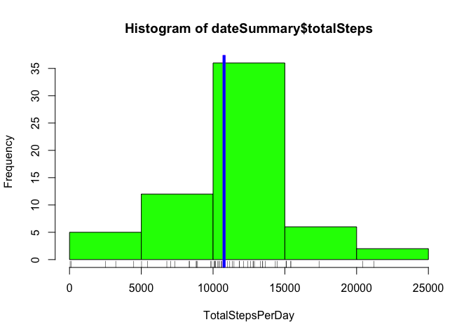
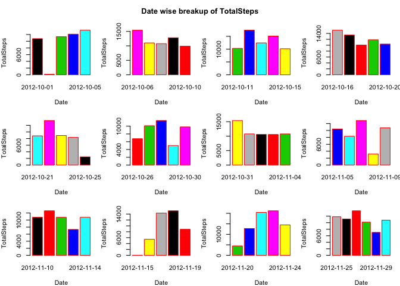
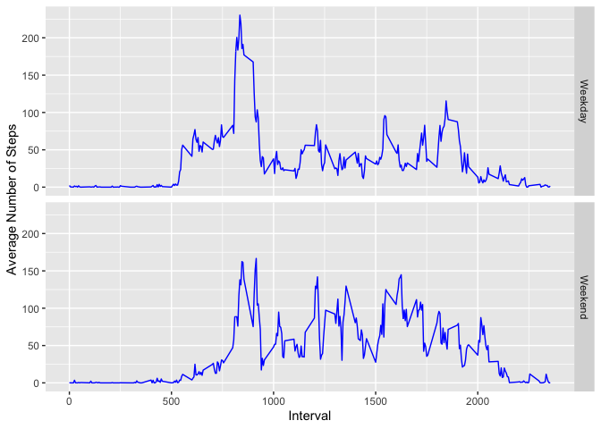

## Initialize Global Settings

```r
library(knitr)
opts_chunk$set(echo = TRUE, message = FALSE, warning = FALSE)
```

## Loading and preprocessing the data

```r
#Load all required packages
library(dplyr)
library(timeDate)
library(ggplot2)

#Read the data
dataset <- read.csv("activity.csv")
```

## What is mean total number of steps taken per day?

```r
plotHistogramTotalSteps <- function(dateSummary) {
    hist(dateSummary$totalSteps, col = "green", xlab = "TotalStepsPerDay")
    rug(dateSummary$totalSteps)
    abline(v = median(dateSummary$totalSteps), col = "magenta", lwd = 4)
    abline(v = mean(dateSummary$totalSteps), col = "blue", lwd = 4)
}

barPlotTotalSteps <- function(dateSummary) {
    par(mfrow = c(3,4), mar = c(4, 4, 2, 1), oma = c(0, 0, 2, 0))
    i <- 1
    while(i < nrow(dateSummary)) {
        j <- i + 4
        if(j == 60) j <- 61
        with(dateSummary[i:j,],
             barplot(totalSteps, names.arg = date, xlab = "Date", ylab = "TotalSteps", 
                     col = date, border = "red"))
        i <- i + 5
    }
    mtext("Date wise breakup of TotalSteps", side = 3, outer = TRUE, cex = 0.8, font = 2)
}

totalStepsTakenEachDay <- function(dataset) {
    groupByDataset <- group_by(dataset, date)
    dateSummary <- summarise(groupByDataset, totalSteps = sum(steps, na.rm = TRUE))
    
    #Plot  histogram on totalSteps
    plotHistogramTotalSteps(dateSummary)
    
    #Create a Barplot to plot totalSteps per day
    barPlotTotalSteps(dateSummary)
    
    meanStepsTakenPerDay <- mean(dateSummary$totalSteps)
    medianStepsTakenPerDay <- median(dateSummary$totalSteps)
    
    print(paste("Mean Steps Taken Per Day = ", meanStepsTakenPerDay))
    print(paste("Median Steps Taken Per Day = " , medianStepsTakenPerDay))
}

totalStepsTakenEachDay(dataset)
```

<!-- --><!-- -->

```
## [1] "Mean Steps Taken Per Day =  9354.22950819672"
## [1] "Median Steps Taken Per Day =  10395"
```

## What is the average daily activity pattern?

```r
timeSeriesPlot <- function(intervalSummary) {
    par(mfrow=c(1,1))
    with(intervalSummary, plot(x = interval, y = meanSteps, type = "l", xlab = "Interval", ylab = "MeanSteps",
                               col = "blue", main = "Time Series Plot of MeanSteps per Interval"))
}

groupByDataset <- group_by(dataset, interval)
intervalSummary <- summarise(groupByDataset, meanSteps = mean(steps, na.rm = TRUE))

timeSeriesPlot(intervalSummary)
```

<!-- -->

```r
intervalWithMaxMeanSteps <- with(intervalSummary, filter(intervalSummary, meanSteps == max(meanSteps))$interval)

print(paste("5 Minute interval having max(meanSteps) = ", intervalWithMaxMeanSteps))
```

```
## [1] "5 Minute interval having max(meanSteps) =  835"
```

```r
print(paste("max(meanSteps) = ", max(intervalSummary$meanSteps)))
```

```
## [1] "max(meanSteps) =  206.169811320755"
```

## Imputing missing values

```r
inputMissingValues <- function(dataset) {
    numberOfNARows <- sum(!complete.cases(dataset))
    print(paste("Number of Rows with NAs = ", numberOfNARows))
    
    #Clone dataset into a new data frame to input NA values
    datasetWithNoNAs <- cbind(dataset)

    #Fill in NAs for column steps with the median values computed in dateSummary
    datasetWithNoNAs <- datasetWithNoNAs %>% group_by(interval) %>% mutate(steps = ifelse(is.na(steps), mean(steps, na.rm = TRUE), steps))
    
    totalStepsTakenEachDay(datasetWithNoNAs)
    
    datasetWithNoNAs
}

datasetWithNoNAs <- inputMissingValues(dataset)
```

```
## [1] "Number of Rows with NAs =  2304"
```

<!-- --><!-- -->

```
## [1] "Mean Steps Taken Per Day =  10766.1886792453"
## [1] "Median Steps Taken Per Day =  10766.1886792453"
```

## Are there differences in activity patterns between weekdays and weekends?

```r
#Create a new factor column to indicate Weekday vs Weekend for a given date
datasetWithNoNAs <- mutate(datasetWithNoNAs, dayClassification = as.factor(ifelse(isWeekday(date, wday=1:5), "Weekday", "Weekend")))

#Group by the dataset with interval and dayClassification
groupByDataset <- group_by(datasetWithNoNAs, interval, dayClassification)
intervalSummaryWeekDay <- summarise(groupByDataset, meanSteps = mean(steps, na.rm = TRUE))

weekdayTrendPlot <- ggplot(intervalSummaryWeekDay, aes(interval, meanSteps))
weekdayTrendPlot <- weekdayTrendPlot + geom_line(color = "blue") + labs(x = "Interval", y = "Average Number of Steps") +
                    facet_grid( dayClassification ~ . )
print(weekdayTrendPlot)
```

<!-- -->
